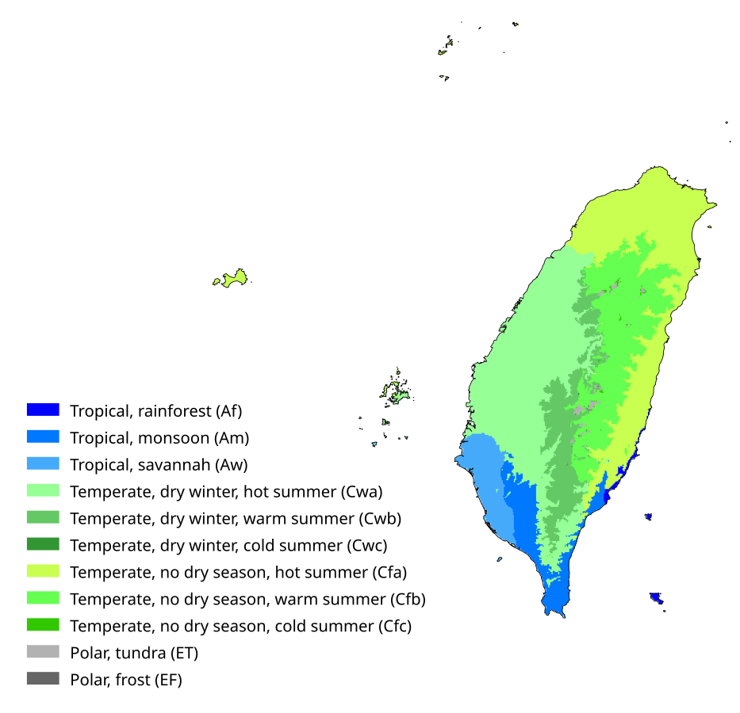
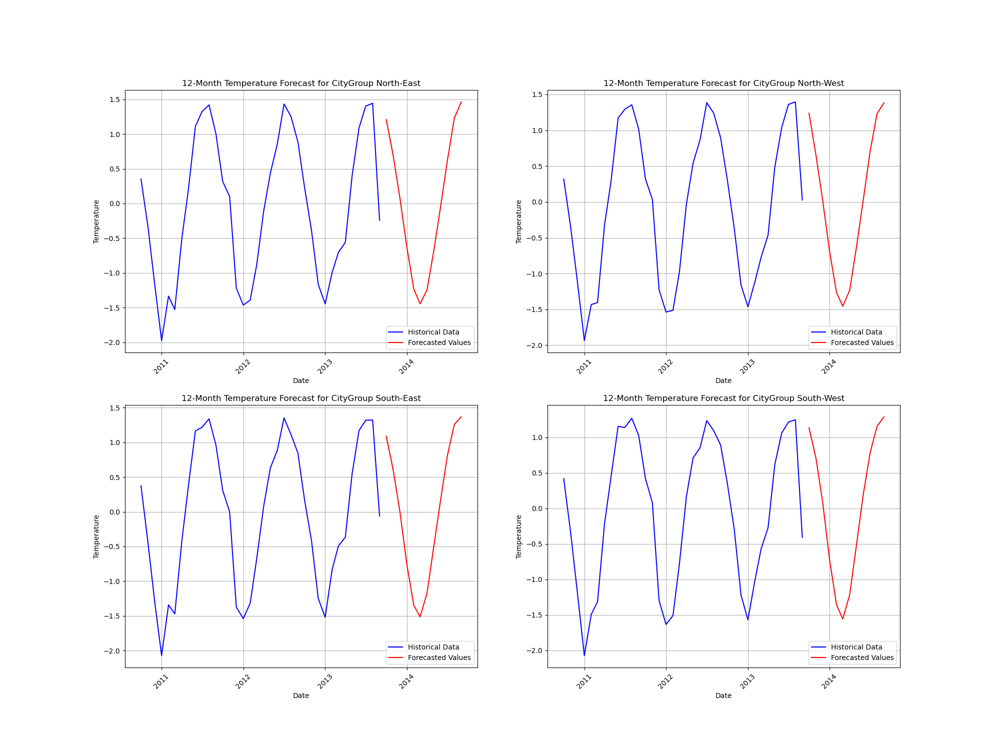
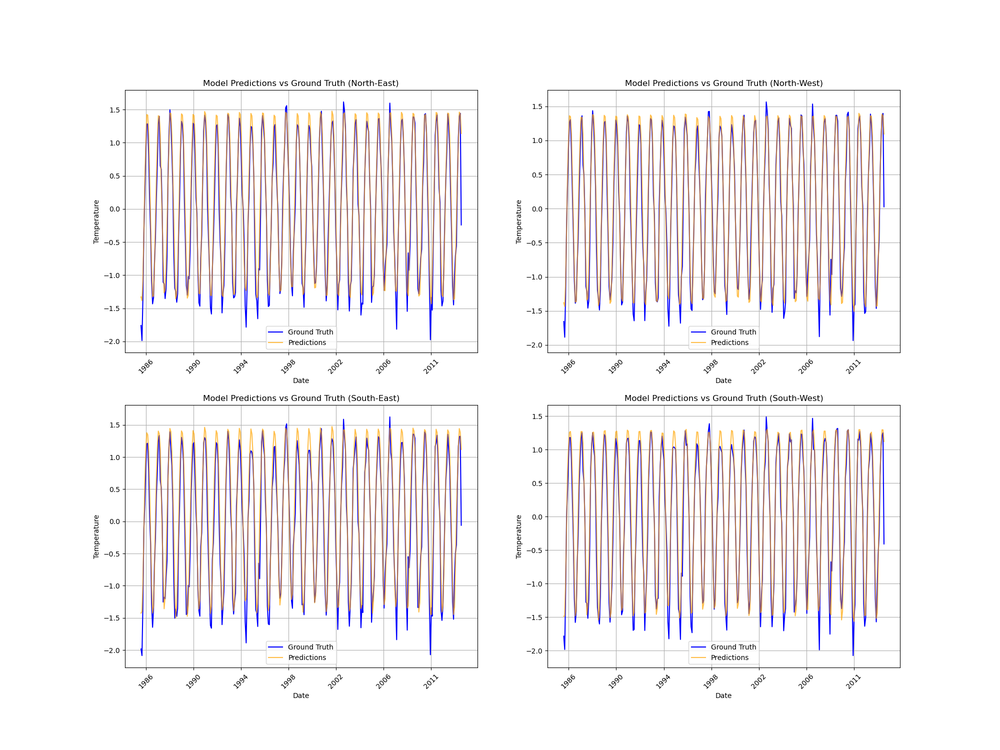

# Study of Taiwan Land Surface Temperature

The final approach to the study is all contained in `data-summary-2.ipynb` notebook, which generates a `.csv` file containing the final dataset, this can be used to feed the models. The feature engenieering of the dataset is introduced below:

#### Starting dataset study (from Kaggle file)
The dataset has monthly frequency temperature records for cities all over the world. A description of the `Country = Taiwan` dataset is presented below:
- **Dataset shape**: No. of Samples: `62190` - No. of Features: `7`.
- **Features**: `[dt, AverageTemperature, AverageTemperatureUncertainty, City, Country, Latitude, Longitude]`
- **City samples**: 2073 samples per city. 30 cities in total. 
- **NULL values**: 84 empty records in `AverageTemperature` and `AverageTemperatureUncertainty` out of `62190` samples
- **Feature description**: statistical description of `AverageTemperature` and `AverageTemperatureUncertainty` features.
```bash
                                 count       mean       std     min     25%  \
AverageTemperature             62106.0  21.682917  4.634189  10.475  17.558   
AverageTemperatureUncertainty  62106.0   0.678325  0.619105   0.060   0.244   

                                  50%     75%     max  
AverageTemperature             22.262  25.955  29.815  
AverageTemperatureUncertainty   0.363   1.065   4.755
```

#### Feature Engineering
1. Groupping cities by coordinates and temperature records, when exploring the dataset we found out that some cities had duplicate coordinates and temperature records. You can see a summary below:
  1. **North-West CityGroup**: Chungho, Chupei, Hsinchu, Luchou, Pate, Pingchen, Sanchung, Sanhsia, Shulin, Taichung, Tali, Tanshui, Taoyüan, Tucheng, Yüanlin, Yangmei
  2. **North-East CityGroup**: Hsichih, Hsintien, Keelung, Panchiao, Taipei, Yungho
  3. **South-West CityGroup**: Fengshan, Kaohsiung, Pingtung, Tainan, Touliu
  4. **South-East CityGroup**: Nantou, Taitung, Yungkang
2. Dropping duplicates, new dataset shape ``.
3. Generate a new feature `season` based on the months of the year where Dec-Feb is `Winter`, Mar-May is `Spring`, Jun-Aug is `Summer` and Sep-Nov is `Fall`.
4. Generate a new feature `Anomaly`: 
   1. We compute the average temperature with all samples in the dataset for each of the seasons defined in the step above.
   2. For every sample, the difference between the season average temperature and that sample temperature.
   3. This is the `Anomaly` feature, it illustrates how far is a month's temperature from the average of that season.
5. Generate a `climate_type` feature, which maps the `Latitude` and `Longitude` to a Koppen-Geiger map of Taiwan which assigns its pixels/coordinates to a certain types of climate. These are the climate types:


6. Filling in NULL values by the median of that feature.
7. Handling outliers:
   1. Spotting outliers with the 1.5 IQR rule.
   2. Substituting outliers by the median of that feature.
8. Generate a Lag feature `AverageTemperatureVsLastMonth`: the difference between the current AverageTemperature sample and last month's.
9.  Set the `dt` (datetime) feature as the index.

Up to here, these are the details of the dataset:
- **Dataset shape**: No. of Samples: `8292` - No. of Features: `12`.
- **Features**: `[AverageTemperature, AverageTemperatureUncertainty, Country, Latitude, Longitude, CityGroup, Year, Month, season, Anomaly, climate_type,  AverageTemperatureChangeVsLastMonth]`.

#### Encoding the features
Before feeding the dataset to the model we encode part of the features, the process is explained below:
1. Cyclic encoding for month feature, we represent the month feature as a function of sine and cosine, to enhance the recurrency of it.
   1. Month_sine: $\sin{(2\pi\cdot\frac{month - 1}{12})}$
   2. Month_cosine: $\cos{(2\pi\cdot\frac{month - 1}{12})}$
2. Sinosoidal encoding for latitude and longitude to enhance their spatial relations.
3. One-hot encoding to all categorical data (`CityGroup`, `Season` and `climate_type`).

#### Last touches
Drop the country column and sort the dataframe in ascending order. This is the description of the dataset:
- **Dataset shape**: No. of Samples: `8292` - No. of Features: `20`.
- **Features**: `[AverageTemperature, AverageTemperatureUncertainty, lat_sin, lat_cos, long_sin, long_cos, Year, month_sin, month_cos, season_Spring, season_Summer, season_Winter, season_Fall, Anomaly, climate_type_Ac,  AverageTemperatureChangeVsLastMonth, CityGroup_NorthEast, CityGroup_NorthWest, CityGroup_SouthEast, CityGroup_SouthWest]`.

## Repostory structure
### Datasets
Directory for storing all dataset files. For now Taiwan related only. 

### data-summary
Jupyter notebooks performing Exploratory Data Analysis. It includes a set of figures to help illustrate the dataset, also small transformations applied to the coordinates in the dataset. 

### Source code
This directory (`src`) includes the source code to run the program. It consists of several files that contain classes and functions to train and test the model. Here is a list of the main parts of the code in `src` directory:

#### TWTemperatureDataset Class

Pytorch dataset class, returns the dataset as a tuple of lists of PyTorch tensor objects (first element of the tuple is the input features and the second element is the target). The class contains the following methods:
- `get_feature_names()`: Returns a list with the feature names.
- `get_dates()`: Returns a list of the dates of each sample (indexes of the dataset).
- `get_CityGroup()`: Returns a new Pytorch dataset class but this time records filtered only on one of the four `CityGroup` values. Features that remain constant in this case are removed (`longitude`, `latitude` and of course `CityGroup`).

#### Models
I have defined two models so far (LSTM and GRU), though I only have trained with LSTM. 

#### Training loop
The model is trained according to hyperparameters defined in `config.py` file. The `train()` function takes multiple parameters as input and its working is explained below:
1. Loop through the train dataset in batches of size `BATCH_SIZE`, feed the data to the model, compare to the ground truth data computing the loss, udpate the model weights and repeat iteratively for all dataset batches.
2. After all the batches have been fed, we validate the model with the cross_validation dataset, using the same loss function.
3. The epoch that presents the best validation loss is saved in the `checkpoints` directory for later use.

#### Main program
The program first trains and tests the whole dataset (with the four `CityGroup`). The training loss plot is generated and stored in the `logs` folder.

When the above is completed, we set up a loop to go through each of the four `CityGroup`, four new models are trained for each of the `CityGroup`, we still are suffering from overfitting, it all points at the small size of the dataset. Each model is tested and forecasts for the next 12 months are computed.

At last a summary table of the test metrics is shown on screen.
```bash
Summary of the metrics: 
| Model      |   RMSE Loss |   R^2 Score |
|------------+-------------+-------------|
| Taiwan     |    0.310206 |    0.863688 |
| North-East |    0.236149 |    0.938089 |
| North-West |    0.196719 |    0.958322 |
| South-East |    0.276329 |    0.920766 |
| South-West |    0.236984 |    0.936852 |
```
The split I have used for the whole training is [TimeSeriesSplit](https://scikit-learn.org/stable/modules/generated/sklearn.model_selection.TimeSeriesSplit.html) from sklearn, it is important not to shuffle the data in this case to preserve the temporal structure. The proportion is the first 60% of the samples (approx. from 1841 to 1950) is used as train data, the next 20% of the samples is used for cross-validation during the training loop, and the latter 20% of the samples (approx. from 1984 to 2013) is used for the testing phase.


The loss function chosen to train has been MSE Loss, and Adam optimizer. The model has so far been trained for 10 epochs only, you can check all the hyperparameters in the `config.py` file. The data is feeded to the model in batches of 32 samples, after each batch, the model is validated on the cross-validation part of the dataset with the MSE Loss function (same as in training). The average training and cross-validation loss is computed after all batches of data have been feeded through the model and printed on screen. All the training records are saved in the `logs` directory, as well as the loss plot. The model with the best cross-validation loss is saved in the `checkpoints` directory, so it can be later retrieved for testing.





### Checkpoints
Directory to save the best models after training, so it can later be used for testing,

### Logs
Small folder to store loss records and loss plots during training and cross evaluation. Also predictions and ground truth and forecasts with the test dataset.

### Miscellaneous: set-up-github 
Small guide on how to set up Git and GitHub in your computer in case you want to collaborate on the repository.