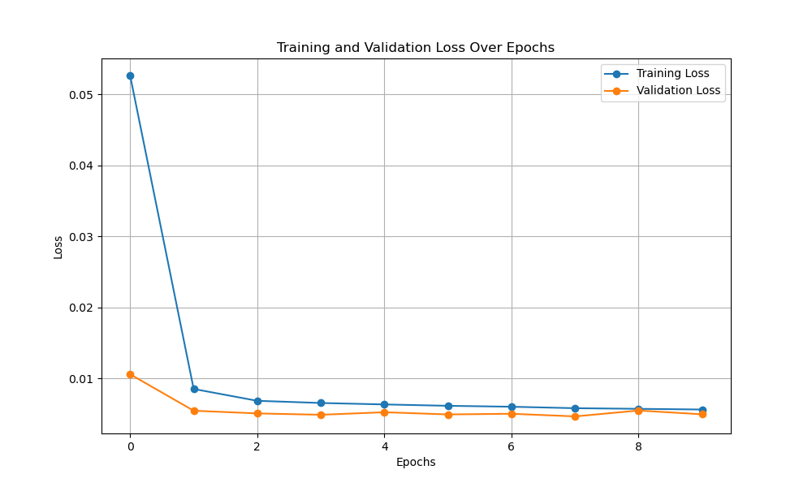

# Study of Taiwan Land Surface Temperature

**UPDATE:** *Due to lack of storage space on Git Large File Storage (LFS) I will have to remove the original datasets from the repository. It topped up the amount of free space to use, I will just keep the Taiwan related datasets. You are welcome to check the transformations applied to the dataset on the data-summary folder.*

After the meeting on 10th Nov., we have decided to focus our effort on working only with the Berkeley's Earth Surface Temperature dataset (instead of using also Air Quality Index). Our plan is to build various models to perform regression tasks. The target of the models being average temperature and the input features being the rest of the fields in the dataset (datetime, city, latitude and longitude).

Some of the possible models that can be explored are:
- Linear regression.
- Random Forest.
- Polynomial regression.
- Gradient boosting model (as explained by professor on the last class).
- Adaboost model.

You can also add your models or other scopes if you have.

As pointed out by Minh there is work to do in the following areas:
- Handling missing values (Nulls).
- Categorical encoding for features such as City.
- Handling outliers (setting up thresholds on the features to not train with outlier data)

What would be nice to do if we have time is also develop some time series forecasting model. To do this we might need more data samples, but we can always use data up-sampling methods to interpolate more samples and increase our dataset size. 

## Repostory structure
### Datasets
Directory for storing all dataset files. For now Taiwan related only. 

### data-summary
Jupyter notebooks performing Exploratory Data Analysis. It includes a set of figures to help illustrate the dataset, also small transformations applied to the coordinates in the dataset. 

### Source code
This directory (`src`) includes the source code to run the program. It consists of several files that contain classes and functions to train and test the model. Here is a list of the main parts of the code in `src` directory:

#### TWTemperatureDataset Class

This class is a PyTorch dataset class of the dataset where I engineered some features, summarized by the following three points:
1. Normalized `AverageTemperature` and `AverageTemperatureUncertainty` features so they are distributed in the [0,1] interval.
2. One-hot encoded `City` feature and dropped `Country` feature, since it was only Taiwan.
3. Added Lag features to exploit temporal relationship. These can be used as a hyper-parameter introducing the amount of lag features required. *What are Lag features?*
  - Lag features represent past observations to provide temporal context. For example:
    - If the `AverageTemperature` column contains monthly temperatures.
      - `AverageTemperature_lag1` contains temperature from the previous month.
      - `AverageTemperature_lag2` contains temperature from two months ago.
      - *for the first records there is no previous temperature, so fills the feature with N/A, thus I drop N/A after generating Lag features*.

Here is an example of the newly engineered dataset to input our model (in this case introducing two extra lag features for AverageTemperature and AverageTemperatureUncertainty respectively). In total we have 37 input features, and the target is AverageTemperature:
```bash
New Input features:  ['AverageTemperatureUncertainty', 'Latitude', 'Longitude', 'City_Bade', 'City_Banqiao', 'City_Dali', 'City_Douliu', 'City_Fongshan', 'City_Hsinchu', 'City_Kaohsiung', 'City_Keelung', 'City_Luzhou', 'City_Nantou', 'City_Pingtung', 'City_Pingzhen', 'City_Sanchong', 'City_Sanxia', 'City_Shuilin', 'City_Taichung', 'City_Tainan', 'City_Taipei', 'City_Taitung', 'City_Tamsui', 'City_Taoyuan', 'City_Toucheng', 'City_Xindian', 'City_Xizhi', 'City_Yangmei', 'City_Yonghe', 'City_Yongkang', 'City_Yuanlin', 'City_Zhongzhe', 'City_Zhubei', 'AverageTemperature_lag_1', 'AverageTemperature_lag_2', 'AverageTemperatureUncertainty_lag_1', 'AverageTemperatureUncertainty_lag_2']
Example Data Point:
Date of input (index):  1841-01-01 00:00:00
Input (x): tensor([[  0.5154,  25.0632, 121.6391,   0.0000,   0.0000,   0.0000,   0.0000,
           0.0000,   0.0000,   0.0000,   0.0000,   0.0000,   0.0000,   0.0000,
           0.0000,   0.0000,   0.0000,   0.0000,   0.0000,   0.0000,   0.0000,
           0.0000,   0.0000,   0.0000,   0.0000,   0.0000,   1.0000,   0.0000,
           0.0000,   0.0000,   0.0000,   0.0000,   0.0000,   0.2601,   0.1361,
           0.5118,   0.5237],
        [  0.5237,  24.9439, 121.2161,   0.0000,   0.0000,   0.0000,   0.0000,
           0.0000,   0.0000,   0.0000,   0.0000,   0.0000,   0.0000,   0.0000,
           1.0000,   0.0000,   0.0000,   0.0000,   0.0000,   0.0000,   0.0000,
           0.0000,   0.0000,   0.0000,   0.0000,   0.0000,   0.0000,   0.0000,
           0.0000,   0.0000,   0.0000,   0.0000,   0.0000,   0.2543,   0.2601,
           0.5154,   0.5118]])
Target (y): tensor([0.1361])
```

*You might think why not normalize or standardize `longitude` and `latitude` features, well it is not recommended because of the following reasons:*
- Small Range of Values: Since all `longitude` and `latitude` values for Taiwan fall within a narrow range, they are comparable in magnitude. This minimizes the risk of large-scale differences affecting the model training.
- Spatial Interpretability: Geographical features like latitude and longitude can have inherent spatial relationships that models, especially neural networks, can learn better when left in their original scale. Altering these values with normalization or standardization may obscure these relationships.
- Normalization’s Purpose: The purpose of normalization or standardization is typically to ensure features are on the same scale to avoid one dominating the model's optimization process. Here, this isn’t an issue since latitude and longitude values already have similar scales to each other and to other features

#### Models
I have defined two models so far (LSTM and GRU), though I only have trained with LSTM. My idea is to generate a loop in the `main.py` file to go through the two models (maybe even a third one - e.g. SARIMA) to check which has the best performance.

#### Train
The split I have used for the whole training is [TimeSeriesSplit](https://scikit-learn.org/stable/modules/generated/sklearn.model_selection.TimeSeriesSplit.html) from sklearn, it is important not to shuffle the data in this case to preserve the temporal structure. The proportion is the first 60% of the samples (approx. from 1841 to 1950) is used as train data, the next 20% of the samples is used for cross-validation during the training loop, and the latter 20% of the samples (approx. from 1984 to 2013) is used for the testing phase.

The loss function chosen to train has been MSE Loss, and Adam optimizer. The model has so far been trained for 10 epochs only, you can check all the hyperparameters in the `config.py` file. The data is feeded to the model in batches of 32 samples, after each batch, the model is validated on the cross-validation part of the dataset with the MSE Loss function (same as in training). The average training and cross-validation loss is computed after all batches of data have been feeded through the model and printed on screen. All the training records are saved in the `logs` directory, as well as the loss plot. The model with the best cross-validation loss is saved in the `checkpoints` directory, so it can be later retrieved for testing.

Here is a sample of the training command line output:
```bash
Training with cuda device.
Epoch [1/10]: Training Loss: 0.0526; Validation Loss: 0.0106
New best model found! Validation Loss: 0.0106
Epoch [2/10]: Training Loss: 0.0085; Validation Loss: 0.0055
New best model found! Validation Loss: 0.0055
Epoch [3/10]: Training Loss: 0.0068; Validation Loss: 0.0051
New best model found! Validation Loss: 0.0051
Epoch [4/10]: Training Loss: 0.0065; Validation Loss: 0.0049
New best model found! Validation Loss: 0.0049
Epoch [5/10]: Training Loss: 0.0063; Validation Loss: 0.0052
Epoch [6/10]: Training Loss: 0.0061; Validation Loss: 0.0049
Epoch [7/10]: Training Loss: 0.0060; Validation Loss: 0.0050
Epoch [8/10]: Training Loss: 0.0058; Validation Loss: 0.0047
New best model found! Validation Loss: 0.0047
Epoch [9/10]: Training Loss: 0.0057; Validation Loss: 0.0055
Epoch [10/10]: Training Loss: 0.0056; Validation Loss: 0.0049
Loss history saved to /home/lucash/NTUST_GIMT/2024_Fall_Semester/Machine_Learning/taiwan-surface-temperature/logs/2024-11-29-13-56/loss_history.json
Training complete. Best Validation Loss: 0.0047
```



#### Test or evaluation
For test so far I have only coded a class that can compute MSE Loss. It does so, as earlier explained, on the latter 20% of the dataset. It loads the model that achieved the lowest cross-validation score during the training loop, it computes the temperature predictions of that best model and compares it to the ground truth values on the dataset. With both predictions and ground truth, the MSE Loss is computed to give us an indicator of the performance of the trained model and a plot showing ground truth and prediction of temperature is generated and saved on the `logs` folder. There is samples of the execution in below code snippet, also the figure is shown (*Possible `TODO`: implement more evaluation metrics rather than just MSE Loss*).
```bash
Model loaded from /home/lucash/NTUST_GIMT/2024_Fall_Semester/Machine_Learning/taiwan-surface-temperature/checkpoints/best_model.pth
Evaluating with cuda device.
Evaluation Complete. MSE Loss: 0.0044
Plot saved to /home/lucash/NTUST_GIMT/2024_Fall_Semester/Machine_Learning/taiwan-surface-temperature/logs/2024-11-29-13-56/predictions_vs_ground_truth.png
```


*Again please note that the AverageTemperature target is normalized here, thus you do not see the expected ranges of temperature, this I can also change for presentation purposes later on.*

### Checkpoints
Directory to save the best models after training, so it can later be used for testing,

### Logs
Small folder to store loss records and loss plots during training and cross evaluation. Also predictions and ground truth with the test dataset.

### Miscellaneous: set-up-github 
Small guide on how to set up Git and GitHub in your computer in case you want to collaborate on the repository.