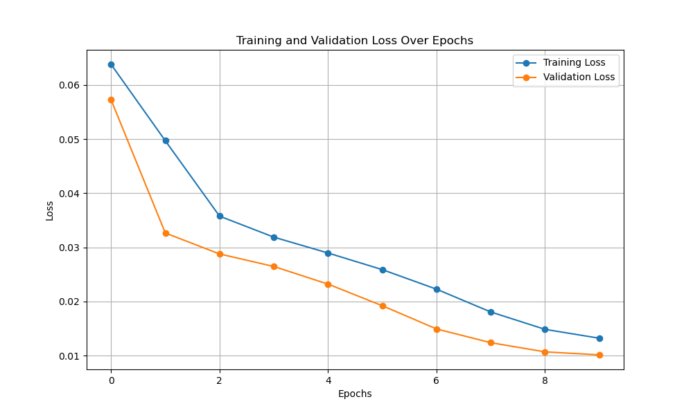
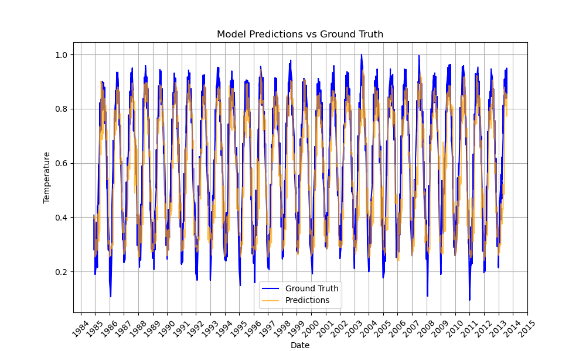

# Study of Taiwan Land Surface Temperature

The final approach to the study is all contained in `data-summary-2.ipynb` notebook, which generates a `.csv` file containing the final dataset, this can be used to feed the models. The feature engenieering of the dataset is introduced below:

#### Starting dataset study (from Kaggle file)
The dataset has monthly frequency temperature records for cities all over the world. A description of the `Country = Taiwan` dataset is presented below:
- **Dataset shape**: No. of Samples: `62190` - No. of Features: `7`.
- **Features**: `[dt, AverageTemperature, AverageTemperatureUncertainty, City, Country, Latitude, Longitude]`
- **City samples**: 2073 samples per city. 30 cities in total. 
- **NULL values**: 84 empty records in `AverageTemperature` and `AverageTemperatureUncertainty` out of `62190` samples
- **Feature description**: statistical description of `AverageTemperature` and `AverageTemperatureUncertainty` features.
```bash
                                 count       mean       std     min     25%  \
AverageTemperature             62106.0  21.682917  4.634189  10.475  17.558   
AverageTemperatureUncertainty  62106.0   0.678325  0.619105   0.060   0.244   

                                  50%     75%     max  
AverageTemperature             22.262  25.955  29.815  
AverageTemperatureUncertainty   0.363   1.065   4.755
```

#### Feature Engineering
1. Groupping cities by coordinates and temperature records, when exploring the dataset we found out that some cities had duplicate coordinates and temperature records. You can see a summary below:
  1. **North-West CityGroup**: Chungho, Chupei, Hsinchu, Luchou, Pate, Pingchen, Sanchung, Sanhsia, Shulin, Taichung, Tali, Tanshui, Taoyüan, Tucheng, Yüanlin, Yangmei
  2. **North-East CityGroup**: Hsichih, Hsintien, Keelung, Panchiao, Taipei, Yungho
  3. **South-West CityGroup**: Fengshan, Kaohsiung, Pingtung, Tainan, Touliu
  4. **South-East CityGroup**: Nantou, Taitung, Yungkang
2. Dropping duplicates, new dataset shape ``.
3. Generate a new feature `season` based on the months of the year where Dec-Feb is `Winter`, Mar-May is `Spring`, Jun-Aug is `Summer` and Sep-Nov is `Fall`.
4. Generate a new feature `Anomaly`: 
   1. We compute the average temperature with all samples in the dataset for each of the seasons defined in the step above.
   2. For every sample, the difference between the season average temperature and that sample temperature.
   3. This is the `Anomaly` feature, it illustrates how far is a month's temperature from the average of that season.
5. Generate a `climate_type` feature, which maps the `Latitude` and `Longitude` to a Koppen-Geiger map of Taiwan which assigns its pixels/coordinates to a certain types of climate. These are the climate types:

6. Filling in NULL values by the median of that feature.
7. Handling outliers:
   1. Spotting outliers with the 1.5 IQR rule.
   2. Substituting outliers by the median of that feature.
8. Generate a Lag feature `AverageTemperatureVsLastMonth`: the difference between the current AverageTemperature sample and last month's.
9.  Set the `dt` (datetime) feature as the index.

Up to here, these are the details of the dataset:
- **Dataset shape**: No. of Samples: `8292` - No. of Features: `12`.
- **Features**: `[AverageTemperature, AverageTemperatureUncertainty, Country, Latitude, Longitude, CityGroup, Year, Month, season, Anomaly, climate_type,  AverageTemperatureChangeVsLastMonth]`.

#### Encoding the features
Before feeding the dataset to the model we encode part of the features, the process is explained below:
1. Cyclic encoding for month feature, we represent the month feature as a function of sine and cosine, to enhance the recurrency of it.
   1. Month_sine: $\sin{(2\pi\cdot\frac{month - 1}{12})}$
   2. Month_cosine: $\cos{(2\pi\cdot\frac{month - 1}{12})}$
2. Sinosoidal encoding for latitude and longitude to enhance their spatial relations.
3. One-hot encoding to all categorical data (`CityGroup`, `Season` and `climate_type`).

#### Last touches
Drop the country column and sort the dataframe in ascending order. This is the description of the dataset:
- **Dataset shape**: No. of Samples: `8292` - No. of Features: `20`.
- **Features**: `[AverageTemperature, AverageTemperatureUncertainty, lat_sin, lat_cos, long_sin, long_cos, Year, month_sin, month_cos, season_Spring, season_Summer, season_Winter, season_Fall, Anomaly, climate_type_Ac,  AverageTemperatureChangeVsLastMonth, CityGroup_NorthEast, CityGroup_NorthWest, CityGroup_SouthEast, CityGroup_SouthWest]`.

## Repostory structure
### Datasets
Directory for storing all dataset files. For now Taiwan related only. 

### data-summary
Jupyter notebooks performing Exploratory Data Analysis. It includes a set of figures to help illustrate the dataset, also small transformations applied to the coordinates in the dataset. 

### Source code
This directory (`src`) includes the source code to run the program. It consists of several files that contain classes and functions to train and test the model. Here is a list of the main parts of the code in `src` directory:

#### TWTemperatureDataset Class

This class is a PyTorch dataset class of the dataset where I engineered some features, summarized by the following three points:
1. Normalized `AverageTemperature` and `AverageTemperatureUncertainty` features so they are distributed in the [0,1] interval.
2. One-hot encoded `City` feature and dropped `Country` feature, since it was only Taiwan.
3. Added Lag features to exploit temporal relationship. These can be used as a hyper-parameter introducing the amount of lag features required. *What are Lag features?*
  - Lag features represent past observations to provide temporal context. For example:
    - If the `AverageTemperature` column contains monthly temperatures.
      - `AverageTemperature_lag1` contains temperature from the previous month.
      - `AverageTemperature_lag2` contains temperature from two months ago.
      - *for the first records there is no previous temperature, so fills the feature with N/A, thus I drop N/A after generating Lag features*.

Here is an example of the newly engineered dataset to input our model (in this case introducing two extra lag features for AverageTemperature and AverageTemperatureUncertainty respectively). In total we have 37 input features, and the target is AverageTemperature:
```bash
New Input features:  ['AverageTemperatureUncertainty', 'Latitude', 'Longitude', 'City_Bade', 'City_Banqiao', 'City_Dali', 'City_Douliu', 'City_Fongshan', 'City_Hsinchu', 'City_Kaohsiung', 'City_Keelung', 'City_Luzhou', 'City_Nantou', 'City_Pingtung', 'City_Pingzhen', 'City_Sanchong', 'City_Sanxia', 'City_Shuilin', 'City_Taichung', 'City_Tainan', 'City_Taipei', 'City_Taitung', 'City_Tamsui', 'City_Taoyuan', 'City_Toucheng', 'City_Xindian', 'City_Xizhi', 'City_Yangmei', 'City_Yonghe', 'City_Yongkang', 'City_Yuanlin', 'City_Zhongzhe', 'City_Zhubei', 'AverageTemperature_lag_1', 'AverageTemperature_lag_2', 'AverageTemperatureUncertainty_lag_1', 'AverageTemperatureUncertainty_lag_2']
Example Data Point:
Date of input (index):  1841-01-01 00:00:00
Input (x): tensor([[  0.5154,  25.0632, 121.6391,   0.0000,   0.0000,   0.0000,   0.0000,
           0.0000,   0.0000,   0.0000,   0.0000,   0.0000,   0.0000,   0.0000,
           0.0000,   0.0000,   0.0000,   0.0000,   0.0000,   0.0000,   0.0000,
           0.0000,   0.0000,   0.0000,   0.0000,   0.0000,   1.0000,   0.0000,
           0.0000,   0.0000,   0.0000,   0.0000,   0.0000,   0.2601,   0.1361,
           0.5118,   0.5237],
        [  0.5237,  24.9439, 121.2161,   0.0000,   0.0000,   0.0000,   0.0000,
           0.0000,   0.0000,   0.0000,   0.0000,   0.0000,   0.0000,   0.0000,
           1.0000,   0.0000,   0.0000,   0.0000,   0.0000,   0.0000,   0.0000,
           0.0000,   0.0000,   0.0000,   0.0000,   0.0000,   0.0000,   0.0000,
           0.0000,   0.0000,   0.0000,   0.0000,   0.0000,   0.2543,   0.2601,
           0.5154,   0.5118]])
Target (y): tensor([0.1361])
```

*You might think why not normalize or standardize `longitude` and `latitude` features, well it is not recommended because of the following reasons:*
- Small Range of Values: Since all `longitude` and `latitude` values for Taiwan fall within a narrow range, they are comparable in magnitude. This minimizes the risk of large-scale differences affecting the model training.
- Spatial Interpretability: Geographical features like latitude and longitude can have inherent spatial relationships that models, especially neural networks, can learn better when left in their original scale. Altering these values with normalization or standardization may obscure these relationships.
- Normalization’s Purpose: The purpose of normalization or standardization is typically to ensure features are on the same scale to avoid one dominating the model's optimization process. Here, this isn’t an issue since latitude and longitude values already have similar scales to each other and to other features

#### Models
I have defined two models so far (LSTM and GRU), though I only have trained with LSTM. My idea is to generate a loop in the `main.py` file to go through the two models (maybe even a third one - e.g. SARIMA) to check which has the best performance.

#### Train
The split I have used for the whole training is [TimeSeriesSplit](https://scikit-learn.org/stable/modules/generated/sklearn.model_selection.TimeSeriesSplit.html) from sklearn, it is important not to shuffle the data in this case to preserve the temporal structure. The proportion is the first 60% of the samples (approx. from 1841 to 1950) is used as train data, the next 20% of the samples is used for cross-validation during the training loop, and the latter 20% of the samples (approx. from 1984 to 2013) is used for the testing phase.

The loss function chosen to train has been MSE Loss, and Adam optimizer. The model has so far been trained for 10 epochs only, you can check all the hyperparameters in the `config.py` file. The data is feeded to the model in batches of 32 samples, after each batch, the model is validated on the cross-validation part of the dataset with the MSE Loss function (same as in training). The average training and cross-validation loss is computed after all batches of data have been feeded through the model and printed on screen. All the training records are saved in the `logs` directory, as well as the loss plot. The model with the best cross-validation loss is saved in the `checkpoints` directory, so it can be later retrieved for testing.

Here is a sample of the training command line output:
```bash
Training with cuda device.
Epoch [1/10]: Training Loss: 0.0638; Validation Loss: 0.0573
New best model found! Validation Loss: 0.0573
Epoch [2/10]: Training Loss: 0.0497; Validation Loss: 0.0327
New best model found! Validation Loss: 0.0327
Epoch [3/10]: Training Loss: 0.0358; Validation Loss: 0.0288
New best model found! Validation Loss: 0.0288
Epoch [4/10]: Training Loss: 0.0319; Validation Loss: 0.0265
New best model found! Validation Loss: 0.0265
Epoch [5/10]: Training Loss: 0.0290; Validation Loss: 0.0232
New best model found! Validation Loss: 0.0232
Epoch [6/10]: Training Loss: 0.0259; Validation Loss: 0.0192
New best model found! Validation Loss: 0.0192
Epoch [7/10]: Training Loss: 0.0223; Validation Loss: 0.0149
New best model found! Validation Loss: 0.0149
Epoch [8/10]: Training Loss: 0.0181; Validation Loss: 0.0124
New best model found! Validation Loss: 0.0124
Epoch [9/10]: Training Loss: 0.0149; Validation Loss: 0.0107
New best model found! Validation Loss: 0.0107
Epoch [10/10]: Training Loss: 0.0132; Validation Loss: 0.0102
New best model found! Validation Loss: 0.0102
Loss history saved to /home/lucash/NTUST_GIMT/2024_Fall_Semester/Machine_Learning/taiwan-surface-temperature/logs/2024-12-02-15-04/loss_history.json
Training complete. Best Validation Loss: 0.0102
```



#### Test or evaluation
For test so far I have only coded a class that can compute MSE Loss. It does so, as earlier explained, on the latter 20% of the dataset. It loads the model that achieved the lowest cross-validation score during the training loop, it computes the temperature predictions of that best model and compares it to the ground truth values on the dataset. With both predictions and ground truth, the MSE Loss is computed to give us an indicator of the performance of the trained model and a plot showing ground truth and prediction of temperature is generated and saved on the `logs` folder. There is samples of the execution in below code snippet, also the figure is shown (*Possible `TODO`: implement more evaluation metrics rather than just MSE Loss*).
```bash
Model loaded from /home/lucash/NTUST_GIMT/2024_Fall_Semester/Machine_Learning/taiwan-surface-temperature/checkpoints/best_model.pth
Evaluating with cuda device.
Evaluation Complete. MSE Loss: 0.0100
Plot saved to /home/lucash/NTUST_GIMT/2024_Fall_Semester/Machine_Learning/taiwan-surface-temperature/logs/2024-12-02-15-04/predictions_vs_ground_truth.png
```



*Again please note that the AverageTemperature target is normalized here, thus you do not see the expected ranges of temperature, this I can also change for presentation purposes later on.*

### Checkpoints
Directory to save the best models after training, so it can later be used for testing,

### Logs
Small folder to store loss records and loss plots during training and cross evaluation. Also predictions and ground truth with the test dataset.

### Miscellaneous: set-up-github 
Small guide on how to set up Git and GitHub in your computer in case you want to collaborate on the repository.