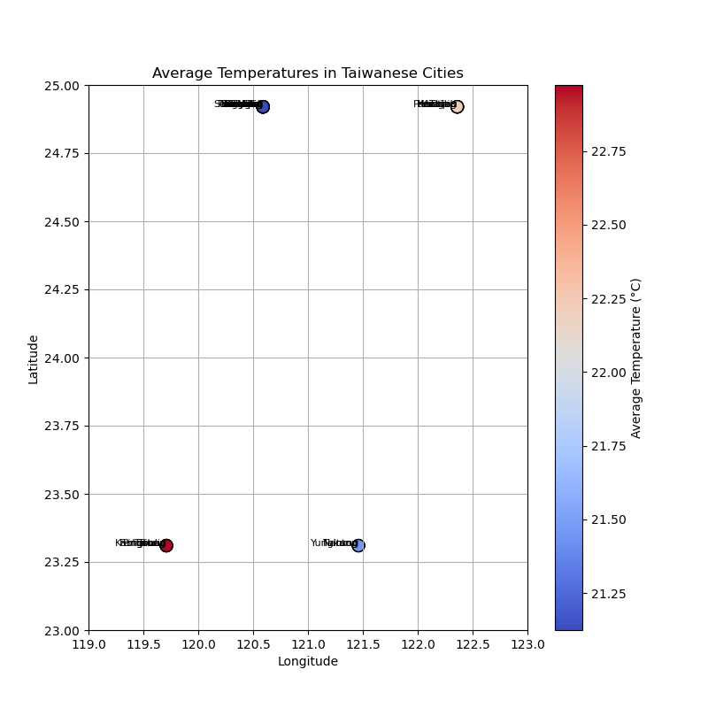

# taiwan-surface-temperature
For now I only used the GlobalLandTemperaturesByCity.csv file, and found the following:

Small preview of the dataset:
```bash
dt  AverageTemperature  AverageTemperatureUncertainty  \
1611881  1841-01-01              13.108                          2.519   
1611882  1841-02-01              13.234                          1.908   
1611883  1841-03-01              14.386                          2.383   
1611884  1841-04-01              18.287                          2.057   
1611885  1841-05-01              22.627                          1.423   
...             ...                 ...                            ...   
8455430  2013-05-01              24.013                          0.322   
8455431  2013-06-01              26.182                          0.410   
8455432  2013-07-01              26.700                          0.515   
8455433  2013-08-01              26.710                          0.428   
8455434  2013-09-01                 NaN                            NaN   

             City Country Latitude Longitude  
1611881   Chungho  Taiwan   24.92N   120.59E  
1611882   Chungho  Taiwan   24.92N   120.59E  
1611883   Chungho  Taiwan   24.92N   120.59E  
1611884   Chungho  Taiwan   24.92N   120.59E  
1611885   Chungho  Taiwan   24.92N   120.59E  
...           ...     ...      ...       ...  
8455430  Yungkang  Taiwan   23.31N   121.46E  
8455431  Yungkang  Taiwan   23.31N   121.46E  
8455432  Yungkang  Taiwan   23.31N   121.46E  
8455433  Yungkang  Taiwan   23.31N   121.46E  
8455434  Yungkang  Taiwan   23.31N   121.46E
```

Dataset size: (62190, 7)

Taiwanese cities in the dataset (30 in total), and number of records per city:
```bash
City
Chungho      2073
Chupei       2073
Yungho       2073
Yangmei      2073
Yüanlin      2073
Tucheng      2073
Touliu       2073
Taoyüan      2073
Tanshui      2073
Tali         2073
Taitung      2073
Taipei       2073
Tainan       2073
Taichung     2073
Shulin       2073
Sanhsia      2073
Sanchung     2073
Pingtung     2073
Pingchen     2073
Pate         2073
Panchiao     2073
Nantou       2073
Luchou       2073
Keelung      2073
Kaohsiung    2073
Hsintien     2073
Hsinchu      2073
Hsichih      2073
Fengshan     2073
Yungkang     2073
```

Missing values in some features (total 84 only in AverageTemperature and AverageTemperatureUncertainty features)
```bash
dt                                0
AverageTemperature               84
AverageTemperatureUncertainty    84
City                              0
Country                           0
Latitude                          0
Longitude                         0
dtype: int64
```

No duplicate values for any of the taiwanese cities in the dataset.

Summary on the temperature features. [You can read here for further detail on this .describe() function](https://pandas.pydata.org/pandas-docs/stable/reference/api/pandas.DataFrame.describe.html).

```bash
                                 count       mean       std     min     25%  \
AverageTemperature             62106.0  21.682917  4.634189  10.475  17.558   
AverageTemperatureUncertainty  62106.0   0.678325  0.619105   0.060   0.244   

                                  50%     75%     max  
AverageTemperature             22.262  25.955  29.815  
AverageTemperatureUncertainty   0.363   1.065   4.755 
```

I computed the average temperature for each cities, and plotted them according to the coordinates that appear in the dataset, it seems there is lack of precission in the latitude and longitude measurements for each city.



`TODO: Find the correct coordinates for each of the 30 cities in the dataset, it should be easy to apply the new latitude and longitude values to all cities afterwards.`