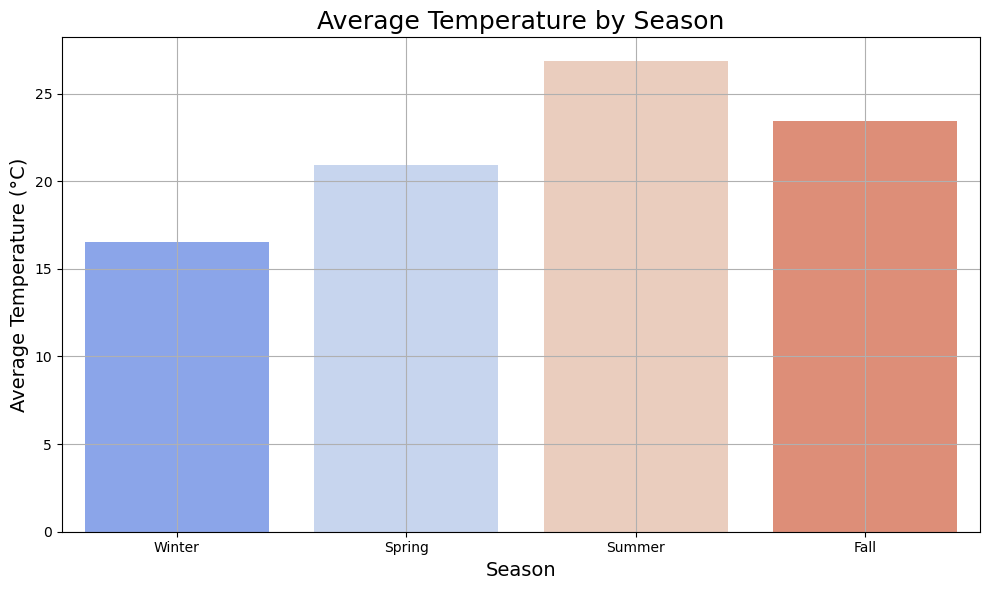
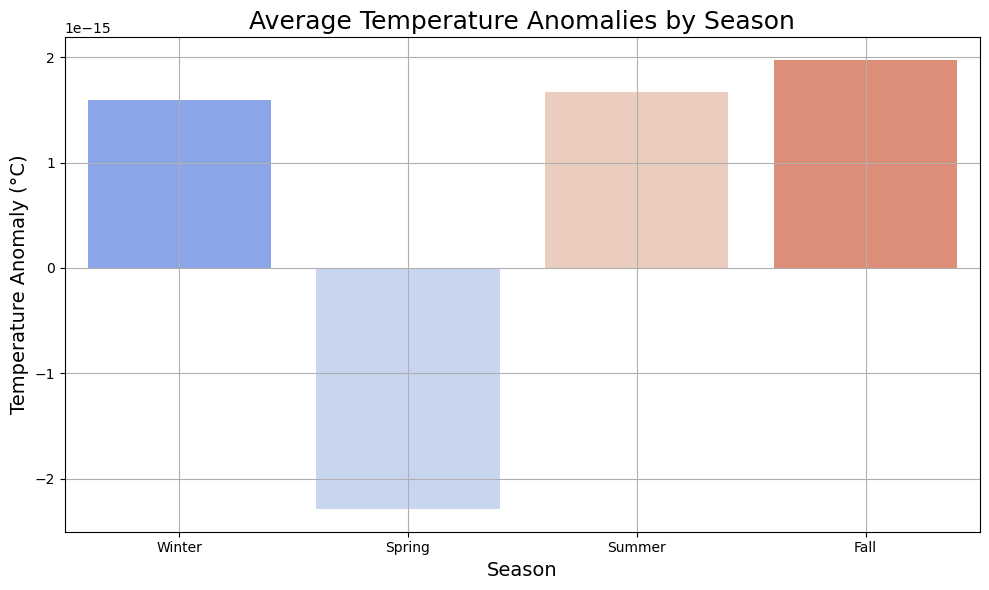

# taiwan-surface-temperature
This analysis will give insight on the *GlobalLandTemperaturesByCity.csv* data. I had to edit the coordinates (longitude and latitude) and the city names from the Berkeley Earth Surface Temperature Dataset. I output the corrected dataset in *TaiwanLandTemperaturesByCity.csv*, below points summarize the corrected dataset:

Small preview of the dataset:
```bash
               dt  AverageTemperature  AverageTemperatureUncertainty  \
0      1841-01-01              13.108                          2.519   
1      1841-02-01              13.234                          1.908   
2      1841-03-01              14.386                          2.383   
3      1841-04-01              18.287                          2.057   
4      1841-05-01              22.627                          1.423   
...           ...                 ...                            ...   
62185  2013-05-01              24.013                          0.322   
62186  2013-06-01              26.182                          0.410   
62187  2013-07-01              26.700                          0.515   
62188  2013-08-01              26.710                          0.428   
62189  2013-09-01                 NaN                            NaN   

           City Country Latitude Longitude  
0      Zhongzhe  Taiwan  24.9964  121.4855  
1      Zhongzhe  Taiwan  24.9964  121.4855  
2      Zhongzhe  Taiwan  24.9964  121.4855  
3      Zhongzhe  Taiwan  24.9964  121.4855  
4      Zhongzhe  Taiwan  24.9964  121.4855  
...         ...     ...      ...       ...  
62185  Yongkang  Taiwan  23.0229  120.2633  
62186  Yongkang  Taiwan  23.0229  120.2633  
62187  Yongkang  Taiwan  23.0229  120.2633  
62188  Yongkang  Taiwan  23.0229  120.2633  
62189  Yongkang  Taiwan  23.0229  120.2633
```

Dataset size: `(62190, 7)`

Taiwanese cities in the dataset (30 in total), and number of records per city:
```bash
City
Zhongzhe     2073
Zhubei       2073
Yonghe       2073
Yangmei      2073
Yuanlin      2073
Toucheng     2073
Douliu       2073
Taoyuan      2073
Tamsui       2073
Dali         2073
Taitung      2073
Taipei       2073
Tainan       2073
Taichung     2073
Shuilin      2073
Sanxia       2073
Sanchong     2073
Pingtung     2073
Pingzhen     2073
Bade         2073
Banqiao      2073
Nantou       2073
Luzhou       2073
Keelug       2073
Kaohsiung    2073
Xindian      2073
Hsinchu      2073
Xizhi        2073
Fongshan     2073
Yongkang     2073
```

Missing values in some features (total 84 only in AverageTemperature and AverageTemperatureUncertainty features)
```bash
dt                                0
AverageTemperature               84
AverageTemperatureUncertainty    84
City                              0
Country                           0
Latitude                          0
Longitude                         0
dtype: int64
```

No duplicate values for any of the taiwanese cities in the dataset.

Summary on the temperature features. [You can read here for further detail on this .describe() function](https://pandas.pydata.org/pandas-docs/stable/reference/api/pandas.DataFrame.describe.html).

```bash
                                 count       mean       std     min     25%  \
AverageTemperature             62106.0  21.682917  4.634189  10.475  17.558   
AverageTemperatureUncertainty  62106.0   0.678325  0.619105   0.060   0.244   

                                  50%     75%     max  
AverageTemperature             22.262  25.955  29.815  
AverageTemperatureUncertainty   0.363   1.065   4.755 
```

I computed the average temperature for each cities, and plotted them according to the coordinates that appear in the dataset, now you can see how the southern cities of Taiwan have a higher average temperature. The same is true for the cities surrounding the Main Taipei area, this is because it lies on a river basin making the summers long, hot and humid. The more temperate cities are the ones in the central area of Taiwan.


I included the average land temperature trend for all Taiwan in dataset samples. You can appreciate the increasing trend for temperature with time, in green color you have the year 1970, arbitrary value I marked as global warming start point (this can be changed). According to the computed tendency, the average land temperature was increased by almost 1.4^o^C from 1841 to 2013. To put this into perspective, the mean surface temperature for the whole Taiwan in 2022 was of 24.1^o^C according to the [Central Weather Administration of Taiwan (CWA)](https://www.cwa.gov.tw/Data/service/notice/download/Publish_20230914153735.pdf) indicating the rising trend to more present days.


You can see also seasonal patterns on temperature in taiwanese cities, as expected summer months are considerably warmer than winter months. Peak temperatures occur in the month inverval between June and October.


I divided the seasons according to the standard understanding, where Dec-Feb is winter, Mar-May is spring, Jun-Aug is summer and Sep-Nov is fall. I plotted the temperature variation per season considering all records, you can see that Spring and Autumn are the seasons with more statistical variance, due to temperature records varying the most within the months of these seasons. On the other hand, winter and summer seasons show the most correlation within their data samples.


The next plot shows the average temperature per season, logically summer months are the warmer of all year, autumn including the warm month of september is also a hotter season than spring.



Next up, an important measurement to take into account in temperature measurements are temperature anomalies. Temperature anomalies in a season indicate how much the temperature in a specific period deviates from the typical average for that season. A positive anomaly means the temperature was higher than usual for that season, while a negative anomaly means it was lower than usual. Here’s what these anomalies can imply in a seasonal context:
- **Winter anomalies**:
  * **Positive anomaly (warmer than usual)**: Taiwan’s winters are generally mild, so warmer-than-usual winters may feel unseasonably warm, especially in southern Taiwan, with less need for heating. Higher temperatures can reduce the frequency of cold surges from Siberian high-pressure systems, which usually bring cooler weather, especially to northern Taiwan.
  * **Negative anomaly (colder than usual)**: Colder winters, often due to strong Siberian cold fronts, can lead to rare snowfall in higher elevations like Alishan and Hehuanshan. Cold anomalies may impact agriculture, particularly for crops like tea and fruit, which are sensitive to sudden temperature drops.
- **Summer anomalies**:
  * **Positive anomaly (warmer than usual)**: Summer heat anomalies can exacerbate urban heat island effects, particularly in Taipei and Kaohsiung. Higher-than-average temperatures might lead to increased cooling demands, potential health risks from heat stress, and heightened risk of drought, especially if typhoon frequency is lower.
  * **Negative anomaly (colder than usual)**: Unseasonably cool summer weather is rare but could result from persistent cloud cover or typhoon influence, reducing cooling demands and potentially improving comfort. However, excessive rain may disrupt outdoor activities and impact agriculture due to overcast or rainy conditions.
- **Spring anomalies**:
  * **Positive anomaly (warmer than usual)**: Warmer springs could advance the growing season for crops but may also increase the risk of water shortages if rainfall patterns shift. Early warmth might affect traditional festivals or practices tied to seasonal timing, such as flower blooms.
  * **Negative anomaly (colder than usual)**: Cooler springs can delay agricultural cycles and impact the timing of the East Asian monsoon, which usually brings Taiwan’s first major rains. This delay can influence water availability and may shift the onset of plum rains (May–June).
- **Fall anomalies**:
  * **Positive anomaly (warmer than usual)**: A warm autumn can extend the typhoon season, increasing the risk of late-season storms. It can also delay seasonal temperature drops, affecting tourism patterns for fall foliage in mountainous areas.
  * **Negative anomaly (colder than usual)**: Colder autumn weather may bring an earlier start to the winter-like conditions in northern Taiwan and encourage agricultural shifts as farmers adjust to cooler temperatures.

Given Taiwan’s location in East Asia, these anomalies are often influenced by broader climate patterns like the East Asian monsoon, El Niño, and La Niña. Small temperature shifts can have significant local impacts due to Taiwan’s sensitive agricultural landscape, high population density, and seasonal reliance on both monsoon rains and typhoon precipitation for water resources.

*Thank you ChatGPT for providing this awesome interpretation, because I do not have much clue about climate in Spain, less even Taiwan climate*




All in all, I think we could also make use of some of these new features (seasons and temperature anomalies) to enhance our models. Please take a look at the code if you have time, now we need to focus on handling Nulls and encoding the categorical features.