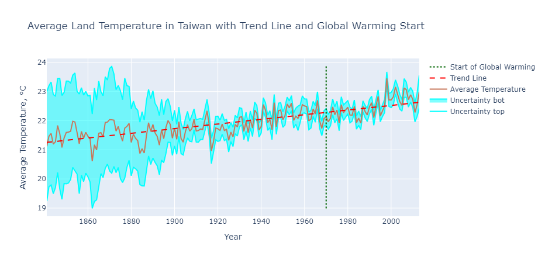

# taiwan-surface-temperature
This analysis will give insight on the *GlobalLandTemperaturesByCity.csv* data. I had to edit the coordinates (longitude and latitude) and the city names from the Berkeley Earth Surface Temperature Dataset. I output the corrected dataset in *TaiwanLandTemperaturesByCity.csv*, below points summarize the corrected dataset:

Small preview of the dataset:
```bash
               dt  AverageTemperature  AverageTemperatureUncertainty  \
0      1841-01-01              13.108                          2.519   
1      1841-02-01              13.234                          1.908   
2      1841-03-01              14.386                          2.383   
3      1841-04-01              18.287                          2.057   
4      1841-05-01              22.627                          1.423   
...           ...                 ...                            ...   
62185  2013-05-01              24.013                          0.322   
62186  2013-06-01              26.182                          0.410   
62187  2013-07-01              26.700                          0.515   
62188  2013-08-01              26.710                          0.428   
62189  2013-09-01                 NaN                            NaN   

           City Country Latitude Longitude  
0      Zhongzhe  Taiwan  24.9964  121.4855  
1      Zhongzhe  Taiwan  24.9964  121.4855  
2      Zhongzhe  Taiwan  24.9964  121.4855  
3      Zhongzhe  Taiwan  24.9964  121.4855  
4      Zhongzhe  Taiwan  24.9964  121.4855  
...         ...     ...      ...       ...  
62185  Yongkang  Taiwan  23.0229  120.2633  
62186  Yongkang  Taiwan  23.0229  120.2633  
62187  Yongkang  Taiwan  23.0229  120.2633  
62188  Yongkang  Taiwan  23.0229  120.2633  
62189  Yongkang  Taiwan  23.0229  120.2633
```

Dataset size: `(62190, 7)`

Taiwanese cities in the dataset (30 in total), and number of records per city:
```bash
City
Zhongzhe     2073
Zhubei       2073
Yonghe       2073
Yangmei      2073
Yuanlin      2073
Toucheng     2073
Douliu       2073
Taoyuan      2073
Tamsui       2073
Dali         2073
Taitung      2073
Taipei       2073
Tainan       2073
Taichung     2073
Shuilin      2073
Sanxia       2073
Sanchong     2073
Pingtung     2073
Pingzhen     2073
Bade         2073
Banqiao      2073
Nantou       2073
Luzhou       2073
Keelug       2073
Kaohsiung    2073
Xindian      2073
Hsinchu      2073
Xizhi        2073
Fongshan     2073
Yongkang     2073
```

Missing values in some features (total 84 only in AverageTemperature and AverageTemperatureUncertainty features)
```bash
dt                                0
AverageTemperature               84
AverageTemperatureUncertainty    84
City                              0
Country                           0
Latitude                          0
Longitude                         0
dtype: int64
```

No duplicate values for any of the taiwanese cities in the dataset.

Summary on the temperature features. [You can read here for further detail on this .describe() function](https://pandas.pydata.org/pandas-docs/stable/reference/api/pandas.DataFrame.describe.html).

```bash
                                 count       mean       std     min     25%  \
AverageTemperature             62106.0  21.682917  4.634189  10.475  17.558   
AverageTemperatureUncertainty  62106.0   0.678325  0.619105   0.060   0.244   

                                  50%     75%     max  
AverageTemperature             22.262  25.955  29.815  
AverageTemperatureUncertainty   0.363   1.065   4.755 
```

I computed the average temperature for each cities, and plotted them according to the coordinates that appear in the dataset, now you can see how the southern cities of Taiwan have a higher average temperature. The same is true for the cities surrounding the Main Taipei area, this is because it lies on a river basin making the summers long, hot and humid. The more temperate cities are the ones in the central area of Taiwan.


Also, I included the average land temperature trend for all Taiwan in dataset samples. You can appreciate the increasing trend for temperature with time, in green color you have the year 1970, arbitrary value I marked as global warming start point (this can be changed).

