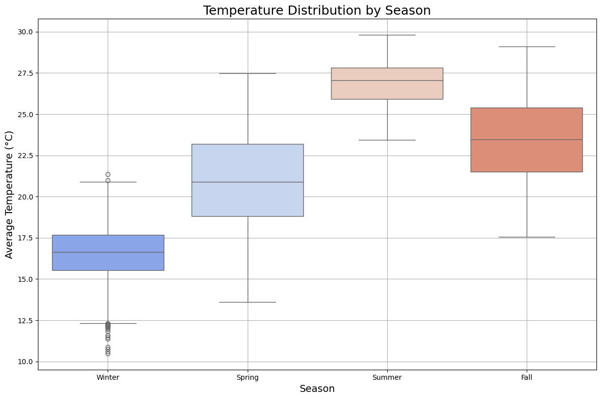

# taiwan-surface-temperature
This analysis will give insight on the Berkeley's Earth Surface Temperature data by cities in Taiwan. I had to edit the coordinates (longitude and latitude) and the city names from the dataset since they were not accurate. I output the corrected dataset in *TaiwanLandTemperaturesByCity.csv*, you can check the editions done in below table:

| Berkeley Dataset City | Corrected City| Berkeley (long, lat) | Corrected (long, lat) |
|-----------------------|---------------|----------------------|-----------------------|
| Pate                  | Bade          | (24.92N, 120.59E)    | (24.9575, 121.2989)   |
| Panchiao              | Banqiao       | (24.92N, 122.36E)    | (25.0143, 121.4672)   |
| Tali                  | Dali          | (24.92N, 120.59E)    | (24.1049, 120.6804)   |
| Touliu                | Douliu        | (23.31N, 119.71E)    | (23.7075, 120.5439)   |
| Fengshan              | Fongshan      | (23.31N, 119.71E)    | (22.6118, 120.3506)   |
| Hsinchu               | Hsinchu       | (24.92N, 120.59E)    | (24.8167, 120.9833)   |
| Kaohsiung             | Kaohsiung     | (23.31N, 119.71E)    | (22.615, 120.2975)    |
| Keelung               | Keelung       | (24.92N, 122.36E)    | (25.1333, 121.7333)   |
| Luchou                | Luzhou        | (24.92N, 120.59E)    | (25.0871, 121.4708)   |
| Nantou                | Nantou        | (23.31N, 121.46E)    | (23.9167, 120.6833)   |
| Pingtung              | Pingtung      | (23.31N, 119.71E)    | (22.6761, 120.4942)   |
| Pingchen              | Pingzhen      | (24.92N, 120.59E)    | (24.9439, 121.2161)   |
| Sanchung              | Sanchong      | (24.92N, 120.59E)    | (25.0616, 121.4871)   |
| Sanhsia               | Sanxia        | (24.92N, 120.59E)    | (24.9358, 121.3751)   |
| Shulin                | Shuilin       | (24.92N, 120.59E)    | (23.5662, 120.234)    |
| Taichung              | Taichung      | (24.92N, 120.59E)    | (24.1439, 120.6794)   |
| Tainan                | Tainan        | (23.31N, 119.71E)    | (22.9833, 120.1833)   |
| Taipei                | Taipei        | (24.92N, 122.36E)    | (25.0375, 121.5625)   |
| Taitung               | Taitung       | (23.31N, 121.46E)    | (22.7583, 121.1444)   |
| Tanshui               | Tamsui        | (24.92N, 120.59E)    | (25.1759, 121.4376)   |
| Taoyüan               | Taoyuan       | (24.92N, 120.59E)    | (24.9913, 121.3143)   |
| Tucheng               | Toucheng      | (24.92N, 120.59E)    | (24.85, 121.8167)     |
| Hsintien              | Xindian       | (24.92N, 122.36E)    | (24.9651, 121.5326)   |
| Hsichih               | Xizhi         | (24.92N, 122.36E)    | (25.0632, 121.6391)   |
| Yangmei               | Yangmei       | (24.92N, 120.59E)    | (24.9167, 121.15)     |
| Yungho                | Yonghe        | (24.92N, 122.36E)    | (25.0107, 121.5147)   |
| Yungkang              | Yongkang      | (23.31N, 121.46E)    | (23.0229, 120.2633)   |
| Yüanlin               | Yuanlin       | (24.92N, 120.59E)    | (23.9611, 120.5736)   |
| Chungho               | Zhongzhe      | (24.92N, 120.59E)    | (24.9964, 121.4855)   |
| Chupei                | Zhubei        | (24.92N, 120.59E)    | (24.8333, 121.0119)   |


## Summary of *TaiwanLandTemperaturesByCity.csv* dataset

Small preview of the dataset:
```bash
                 dt  AverageTemperature  AverageTemperatureUncertainty  \
1611881  1841-01-01              13.108                          2.519   
1611882  1841-02-01              13.234                          1.908   
1611883  1841-03-01              14.386                          2.383   
1611884  1841-04-01              18.287                          2.057   
1611885  1841-05-01              22.627                          1.423   

            City Country Latitude Longitude  
1611881  Chungho  Taiwan   24.92N   120.59E  
1611882  Chungho  Taiwan   24.92N   120.59E  
1611883  Chungho  Taiwan   24.92N   120.59E  
1611884  Chungho  Taiwan   24.92N   120.59E  
1611885  Chungho  Taiwan   24.92N   120.59E
```

Dataset size: `(62190, 7)`

Taiwanese cities in the dataset (30 in total), and number of records per city:
```bash
City
Chungho      2073
Chupei       2073
Yungho       2073
Yangmei      2073
Yüanlin      2073
Tucheng      2073
Touliu       2073
Taoyüan      2073
Tanshui      2073
Tali         2073
Taitung      2073
Taipei       2073
Tainan       2073
Taichung     2073
Shulin       2073
Sanhsia      2073
Sanchung     2073
Pingtung     2073
Pingchen     2073
Pate         2073
Panchiao     2073
Nantou       2073
Luchou       2073
Keelung      2073
Kaohsiung    2073
Hsintien     2073
Hsinchu      2073
Hsichih      2073
Fengshan     2073
Yungkang     2073
Name: count, dtype: int64
```

Missing values in some features (total 84 only in AverageTemperature and AverageTemperatureUncertainty features)
```bash
dt                                0
AverageTemperature               84
AverageTemperatureUncertainty    84
City                              0
Country                           0
Latitude                          0
Longitude                         0
dtype: int64
```

No duplicate values for any of the taiwanese cities in the dataset.

Summary on the temperature features. [You can read here for further detail on this .describe() function](https://pandas.pydata.org/pandas-docs/stable/reference/api/pandas.DataFrame.describe.html).

```bash
                                 count       mean       std     min     25%  \
AverageTemperature             62106.0  21.682917  4.634189  10.475  17.558   
AverageTemperatureUncertainty  62106.0   0.678325  0.619105   0.060   0.244   

                                  50%     75%     max  
AverageTemperature             22.262  25.955  29.815  
AverageTemperatureUncertainty   0.363   1.065   4.755 
```

## Grouping of cities
We realized 4 groups of coordinates were repeating, thus we groupped the cities according to its coordinates, the resulting groups are:
* North-East: Hsichih, Hsintien, Keelung, Panchiao, Taipei, Yungho
* North-West: Chungho, Chupei, Hsinchu, Luchou, Pate, Pingchen, Sanchung, Sanhsia, Shulin, Taichung, Tali, Tanshui, Taoyüan, Tucheng, Yüanlin, Yangmei
* South-East: Nantou, Taitung, Yungkang
* South-West: Fengshan, Kaohsiung, Pingtung, Tainan, Touliu

After accomplishing this grouping, the dataset showed a huge amount of duplicates, we found out this was because cities in each CityGroup not only shared coordinates but also the other features like `AverageTemperature` and `AverageTemperatureUncertainty` were both duplicated within the same `CityGroup`. We then proceed to remove the duplicates.
```bash
Dataset shape: (8292, 7)
```

## Geographical plot of average temperature per CityGroup

I computed the average temperature for each CityGroup, and plotted them according to the coordinates that appear in the dataset, now you can see how the southern cities of Taiwan have a higher average temperature. The same is true for the cities in the North-East (including Taipei), this is because it lies on a river basin making the summers long, hot and humid. The more temperate cities are the ones in the North and Center West of Taiwan, as well as the South-East.


## Trend for average land temperature in Taiwan

I included the average land temperature trend for all Taiwan in dataset samples. You can appreciate the increasing trend for temperature with time, in green color you have the year 1970, arbitrary value I marked as global warming start point (this can be changed). According to the computed tendency, the average land temperature was increased by almost 1.4 $^o$C from 1841 to 2013. To put this into perspective, the mean surface temperature for the whole Taiwan in 2022 was of 24.1 $^o$C according to the [Central Weather Administration of Taiwan (CWA)](https://www.cwa.gov.tw/Data/service/notice/download/Publish_20230914153735.pdf) indicating the rising trend to more present days.


## Seasonal analysis
You can see also seasonal patterns on temperature in taiwanese cities, as expected summer months are considerably warmer than winter months. Peak temperatures occur in the month inverval between June and October.


### Temperature records distribution by season
I divided the seasons according to the standard understanding, where Dec-Feb is winter, Mar-May is spring, Jun-Aug is summer and Sep-Nov is fall. I plotted the temperature variation per season considering all records, you can see that Spring and Autumn are the seasons with more statistical variance, due to temperature records varying the most within the months of these seasons. On the other hand, winter and summer seasons show the most correlation within their data samples.



### Average temperature per season
The next plot shows the average temperature per season, logically summer months are the warmer of all year, autumn including the warm month of september is also a hotter season than spring.


### Anomalies in average temperature data per season
Next up, an important measurement to take into account in temperature measurements are temperature anomalies. Temperature anomalies in a season indicate how much the temperature in a specific period deviates from the typical average for that season. A positive anomaly means the temperature was higher than usual for that season, while a negative anomaly means it was lower than usual. Here’s what these anomalies can imply in a seasonal context:
- **Winter anomalies**:
  * **Positive anomaly (warmer than usual)**: Taiwan’s winters are generally mild, so warmer-than-usual winters may feel unseasonably warm, especially in southern Taiwan, with less need for heating. Higher temperatures can reduce the frequency of cold surges from Siberian high-pressure systems, which usually bring cooler weather, especially to northern Taiwan.
  * **Negative anomaly (colder than usual)**: Colder winters, often due to strong Siberian cold fronts, can lead to rare snowfall in higher elevations like Alishan and Hehuanshan. Cold anomalies may impact agriculture, particularly for crops like tea and fruit, which are sensitive to sudden temperature drops.
- **Summer anomalies**:
  * **Positive anomaly (warmer than usual)**: Summer heat anomalies can exacerbate urban heat island effects, particularly in Taipei and Kaohsiung. Higher-than-average temperatures might lead to increased cooling demands, potential health risks from heat stress, and heightened risk of drought, especially if typhoon frequency is lower.
  * **Negative anomaly (colder than usual)**: Unseasonably cool summer weather is rare but could result from persistent cloud cover or typhoon influence, reducing cooling demands and potentially improving comfort. However, excessive rain may disrupt outdoor activities and impact agriculture due to overcast or rainy conditions.
- **Spring anomalies**:
  * **Positive anomaly (warmer than usual)**: Warmer springs could advance the growing season for crops but may also increase the risk of water shortages if rainfall patterns shift. Early warmth might affect traditional festivals or practices tied to seasonal timing, such as flower blooms.
  * **Negative anomaly (colder than usual)**: Cooler springs can delay agricultural cycles and impact the timing of the East Asian monsoon, which usually brings Taiwan’s first major rains. This delay can influence water availability and may shift the onset of plum rains (May–June).
- **Fall anomalies**:
  * **Positive anomaly (warmer than usual)**: A warm autumn can extend the typhoon season, increasing the risk of late-season storms. It can also delay seasonal temperature drops, affecting tourism patterns for fall foliage in mountainous areas.
  * **Negative anomaly (colder than usual)**: Colder autumn weather may bring an earlier start to the winter-like conditions in northern Taiwan and encourage agricultural shifts as farmers adjust to cooler temperatures.

Given Taiwan’s location in East Asia, these anomalies are often influenced by broader climate patterns like the East Asian monsoon, El Niño, and La Niña. Small temperature shifts can have significant local impacts due to Taiwan’s sensitive agricultural landscape, high population density, and seasonal reliance on both monsoon rains and typhoon precipitation for water resources.

*Thank you ChatGPT for providing this awesome interpretation, because I do not have much clue about climate in Spain, less even Taiwan climate*


### Climate Types

Another feature added is climate types as a new feature engineered for the dataset. I use spatial inference from the coordinate maps from Koppen-Geiger maps focalized on the Taiwan area, which classifies different areas of Taiwan according to their climate type.


Beck, H.E., Zimmermann, N. E., McVicar, T. R., Vergopolan, N., Berg, A., & Wood, E. F.: *Present and future Köppen-Geiger climate classification maps at 1-km resolution* Nature Scientific Data. DOI:[10.1038/sdata.2018.214](https://doi.org/10.1038/sdata.2018.214)

According to the analysis, within the 30 cities of our dataset, we have 4 different climate types only (Cfa, Cwa, Am and Aw). You can see the following summary:

```bash
Zhongzhe: Cfa - Temperate, no dry season, hot summer
Zhubei: Cfa - Temperate, no dry season, hot summer
Fongshan: Aw - Tropical, savannah
Xizhi: Cfa - Temperate, no dry season, hot summer
Hsinchu: Cfa - Temperate, no dry season, hot summer
Xindian: Cfa - Temperate, no dry season, hot summer
Kaohsiung: Aw - Tropical, savannah
Keelung: Cfa - Temperate, no dry season, hot summer
Luzhou: Cfa - Temperate, no dry season, hot summer
Nantou: Cwa - Temperate, dry winter, hot summer
Banqiao: Cfa - Temperate, no dry season, hot summer
Bade: Cfa - Temperate, no dry season, hot summer
Pingzhen: Cfa - Temperate, no dry season, hot summer
Pingtung: Am - Tropical, monsoon
Sanchong: Cfa - Temperate, no dry season, hot summer
Sanxia: Cfa - Temperate, no dry season, hot summer
Shuilin: Cwa - Temperate, dry winter, hot summer
Taichung: Cwa - Temperate, dry winter, hot summer
Tainan: Aw - Tropical, savannah
Taipei: Cfa - Temperate, no dry season, hot summer
Taitung: Am - Tropical, monsoon
Dali: Cwa - Temperate, dry winter, hot summer
Tamsui: Cfa - Temperate, no dry season, hot summer
Taoyuan: Cfa - Temperate, no dry season, hot summer
Douliu: Cwa - Temperate, dry winter, hot summer
Toucheng: Cfa - Temperate, no dry season, hot summer
Yuanlin: Cwa - Temperate, dry winter, hot summer
Yangmei: Cfa - Temperate, no dry season, hot summer
Yonghe: Cfa - Temperate, no dry season, hot summer
Yongkang: Aw - Tropical, savannah
```

I might include this ones as well for training our model, though it is still not implemented.

## Conclusions
All in all, I think we could also make use of some of these new features (seasons and temperature anomalies) to enhance our models. You can take a look at the code if you have time, now we need to focus on handling Nulls and encoding the categorical features.