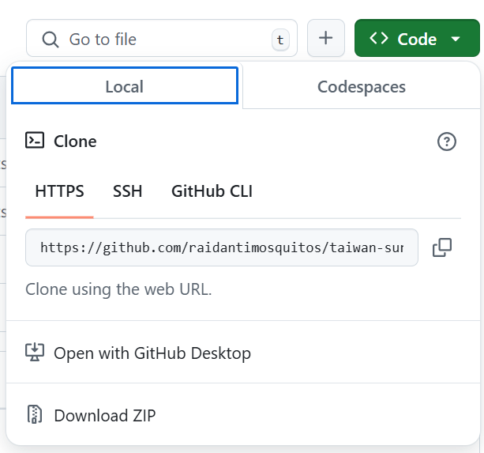

# Setting up Git and GitHub to collaborate on the project
- Git is a distributed version control system that tracks versions of files. It is used to control source code by programmers who are developing software collaboratively.

- GitHub is a developer platform that allows developers to create, store, manage and share their code. It uses Git software which provides distributed version control of access control, bug tracking, software feature requests, task management, continuous integration, and wikis for every project.

## Install Git on your computer
- You can follow the instructions on [Git website](https://git-scm.com/book/en/v2/Getting-Started-Installing-Git), depending on the OS you use. 

- You can check it is correctly installed by running the following commands in your Terminal, Windows PowerShell, etc.:
```bash
git --version
```
*Note: to use git on Windows Powershell, you must update your PATH variable. You can follow the instructions in this [link](https://thelinuxcode.com/add-git-to-path-windows/).*

- If Git is installed it should display the installed version.

## Create your account on GitHub
Create an account (if you do not have one already) on GitHub to manage the project files. GitHub contrary to git offers a more intuitive GUI to manage the code files. If you want to further personalize your GitHub profile you can always refer to the [documentation](https://docs.github.com/en/account-and-profile).


## Setting up Git on your computer
You can set your GitHub username and email on your computer's Git configuration, to do so run below commands in your Terminal of choice.
```bash
git config --global user.name  “username”
git config --global user.email  “username@github.com”
```
Remember to substitute "username" and "username@github.com" for your GitHub credentials. In my case *raidantimosquitos* and *raidantimosquitos@github.com*.

You can check that the configuration changes have been applied (check for user.name and user.email values) by running:
```bash
git config -l
```

## Setting up your GitHub authentication key
In order to be able to *commit* and *push* changes from your computer to the GitHub repository, you will need to authenticate your *pushes* with a GitHub authentication key. The following instructions show you how to generate this key.
1. [Verify](https://docs.github.com/en/account-and-profile/setting-up-and-managing-your-personal-account-on-github/managing-email-preferences/verifying-your-email-address) your email address in GitHub if it has not yet been verified.
2. In the upper-right corner of any page on GitHub, click your profile photo, then click  **Settings**.
3. In the left sidebar, click **Developer** settings.
4. In the left sidebar, under **Personal access tokens**, click **Tokens (classic)**.
5. Select **Generate new token**, then click **Generate new token (classic)**.
6. In the "Note" field, give your token a descriptive name.
7. To give your token an expiration, select **Expiration**, then choose a default option or click Custom to enter a date. I would recommend two months (60 days) so your authentication token expires after we finish the project.
8. Select the scopes you'd like to grant this token. To use your token to access repositories from the command line, select repo.
9. Click **Generate token**.
10. Copy your new token to your clipboard, with the copy icon.


11. Paste your token on a text file and save it in your local PC (outside the repository directory), you will need it when *pushing* changes to the repoistory and it will not be visible again in the GitHub page.

## Cloning the taiwan-surface-temperature repository
- First access to the [GitHub page](https://github.com/raidantimosquitos/taiwan-surface-temperature) of the repository, on the top right area you will find a `Fork` button. Click it and, after some seconds, in your GitHub account a new project with the same name `taiwan-surface-temperature` will be created.
- In the main page of the repository under your GitHub user, find the `Branch:master` button and use it to create a new branch, for instance with your name on it (*michael-jackson*).
- Now you can make a copy of the repository on your local computer, click on the <>Code icon, and in the pop-up you can click the copy icon (make sure you are in Codespaces/HTTPS tab).



*Note that since I created the repository, the link shows under my username (raidantimosquitos), in your case your link should show your own username*

- Navigate in your terminal to the directory where you want to locate the repository (this will be a folder, you can locate it inside your Documents directory or any other of your choice). Once in the directory where you will clone the repository you run the following command, pasting the link copied before on the "project-github-url":

```bash
git clone "project-github-url"
```

- Wait for the repository to clone on your computer, when completed navigate inside the repository main folder, this is done with a simple `cd taiwan-surface-temperature`. Now you should find all the files in the repository but in your local computer. Once inside the main repository folder, add the `origin` tag to your repository copy. This is useful to facilitate *pushes* and *pulls* to the original repository. To do so, run the following command, again change "project-github-url" for the link from GitHub:

```bash
git remote add origin "project-github-url"
```

- Change the branch to your branch (*michael-jackson*) with the following command:

```bash
git checkout michael-jackson
```

- When you reach this point you are able to work on your local directory in the usual way that you would do.

## Submitting changes to the repository

- From this moment, everytime you want to upload your local changes to the GitHub repository you must confirm the changes on your local repository.

```bash
git add .
git commit -m "Commit message"
```
- You can add a short message with your commit describing the changes you are uploading to the repository.

- Right after you run the above two commands, to upload the changes to the repository you must execute the following command:
```bash
git push -u origin michael-jackson
```
- When running this command the terminal will prompt you to identify yourself, you need to use your GitHub username and authentication key as username+password combination for the first time. Then you will get prompted for the same information again, this time you use your GitHub username and password.
  


*In pink color is GitHub username (raidantimosquitos), in yellow the GitHub authentication token you generated earlier, and in orange is your personal GitHub password*.

*Please also note that in this example I am pushing directly to the main repository branch, this should not be your case (you should be committing to your personal branch)*

- This will *push* the changes you made on your local computer to your branch of the repository.

- When you want to merge all the changes made in your local branch to the master branch of the repository you can use GitHub `pull-request` mechanism.
  * Go to the main page of the repository in your GitHub account, and make sure you are in the *michael-jackson* branch.
  * Click on *New pull request*, and follow GitHub's instructions.